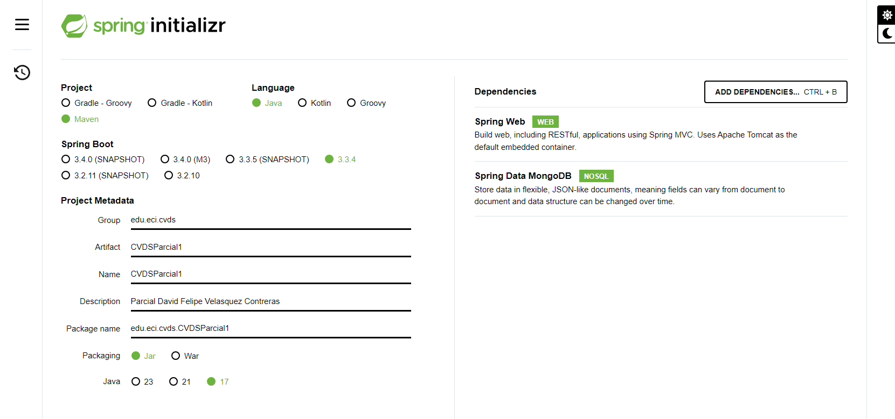
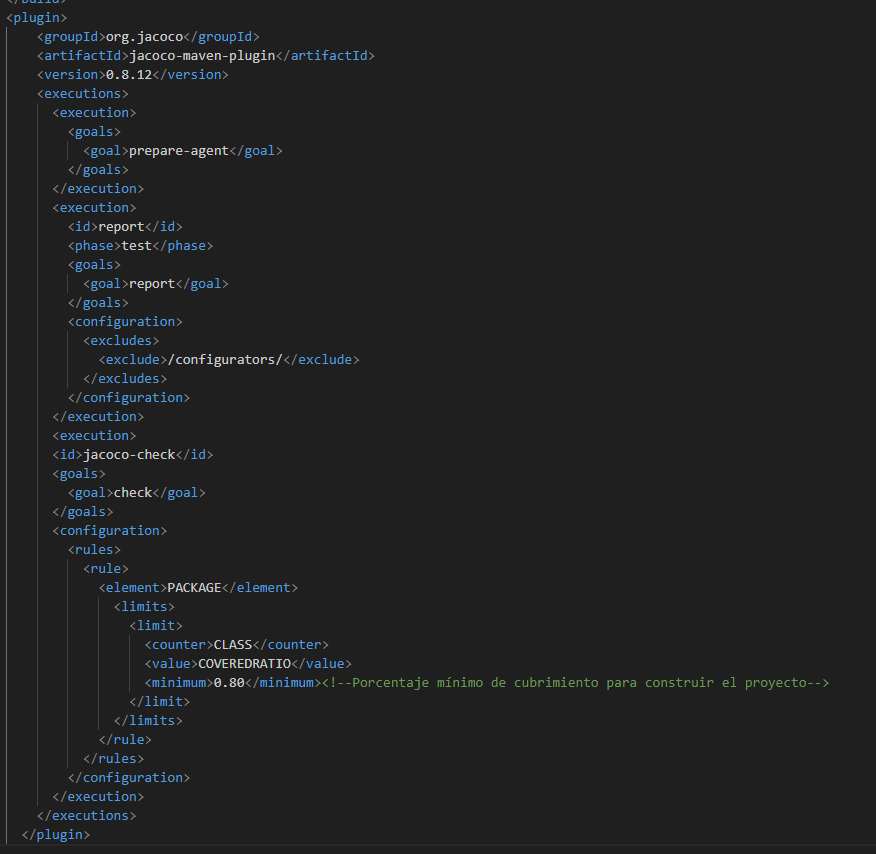

David Felipe Velasquez Contreras

Este es el seguimiento de lo realizado en el parcial 1 de CVDS

en primer lugar se utilizo spring initializer de esta manera:

Con ello ya que no se encuentra alli, añadimos el plugin de jacoco para usarlo mas adelante

Luego se crea el scaffolding de lo que necesitamos:

