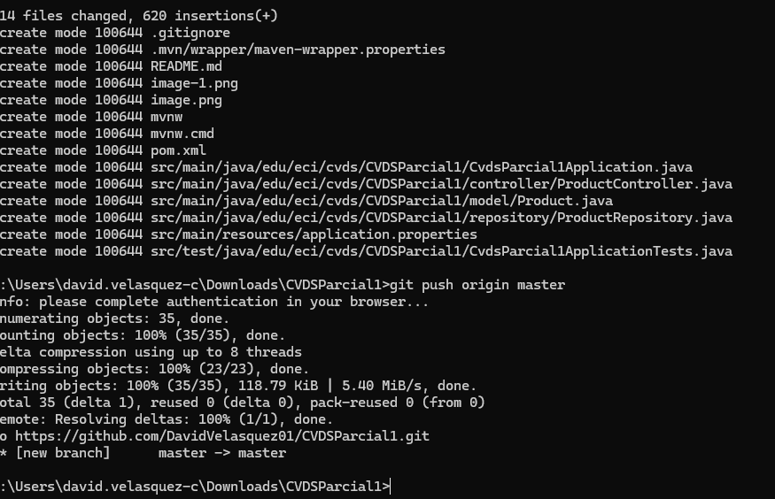
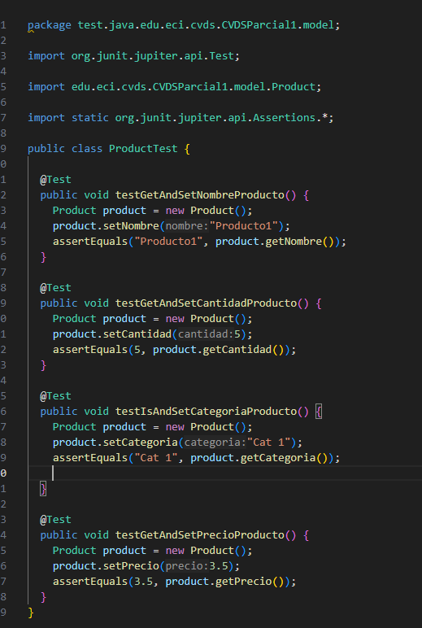
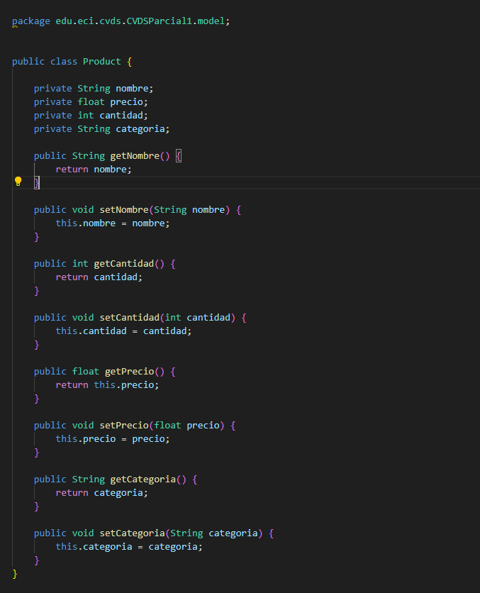

David Felipe Velasquez Contreras

Este es el seguimiento de lo realizado en el parcial 1 de CVDS

en primer lugar se utilizo spring initializer de esta manera:

Con ello ya que no se encuentra alli, añadimos el plugin de jacoco para usarlo mas adelante

Luego se crea el scaffolding de lo que necesitamos y añadimos esta inicializacion del proyecto al repositorio:

Vamos a empezar haciendo pruebas de unidad de lo que necesitariamos que tuviera nuestro modelo de product, lo cual al utilizar 4 elementos que necesitamos necesitaremos probar los getters y setters que realizaremo

Luego de esto lo implementamos en el modelo:

