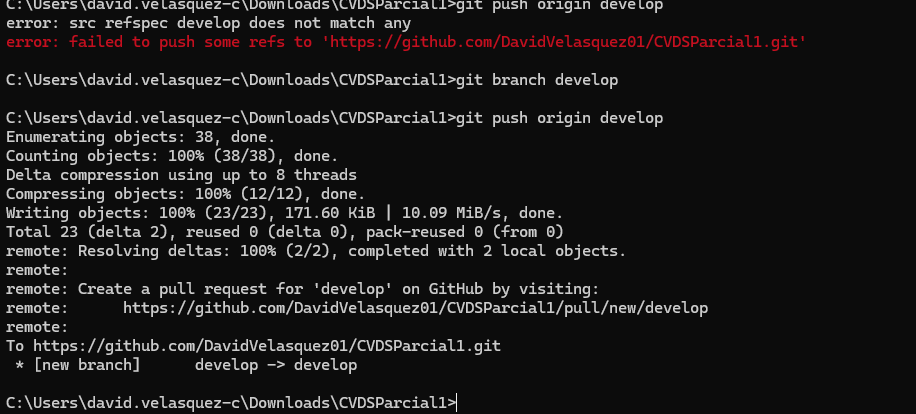
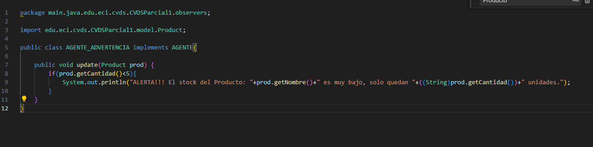

David Felipe Velasquez Contreras

Este es el seguimiento de lo realizado en el parcial 1 de CVDS

en primer lugar se utilizo spring initializer de esta manera:

Con ello ya que no se encuentra alli, añadimos el plugin de jacoco para usarlo mas adelante

Luego se crea el scaffolding de lo que necesitamos y añadimos esta inicializacion del proyecto al repositorio:

Vamos a empezar haciendo pruebas de unidad de lo que necesitariamos que tuviera nuestro modelo de product, lo cual al utilizar 4 elementos que necesitamos necesitaremos probar los getters y setters que realizaremo

Luego creamo una nueva rama develop donde haremos los cambios y haremos un pull request cuando hayamos finalizado

Ahora para el patron de diseño necesitamos utilizar el patron observador, que va a tener presente si algo dentro del product cambia, por ende he aqui la implementacion:

Creamos un nuevo directorio observers donde se encontraran los agentes, esta va a ser nuestra interfaz de agente:

Y esta la implementacion de esta interfaz de cada uno de los agentes

Con esto ya tenemos el mismo metodo implementado para cada uno, ahora los vamos a utilizar en una lista de agentes que se va a crear en cada product.

Y este metodo de notificar agentes sera llamado cada vez que se detecte un cambio en la cantidad que es lo que nos interesa.

Con ello queda implementado nuestro patron observer, utilicé algo de este estilo:

En este caso el Sujeto no es implementado sino que su logica esta desarrollada en producto, el Observador general sera el AGENTE y los dos agentes que tenemos es cada uno de los observadores concretos.

Ahora vamos a implementar el api rest en una nueva clase de ProductService utilizando algunos metodos y formas de persistencia que vamos a implementar en otra clase de ProductRepository

Aqui realizamos la persistencia con un hash map

Y aqui llamamos esos metodos

Ahora si para utilizarlo se necesita hacer el controller que esta aqui:

Con ello deberia bastar segun la logica de la implementacion, vamos a probar el comando de spring boot:

